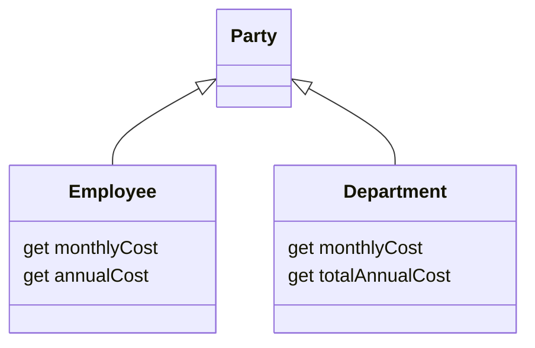

[](https://github.com/kaiosilveira/pull-up-method-refactoring/actions/workflows/ci.yml)

ℹ️ _This repository is part of my Refactoring catalog based on Fowler's book with the same title. Please see [kaiosilveira/refactoring](https://github.com/kaiosilveira/refactoring) for more details._

---

# Pull Up Method

<table>
<thead>
<th>Before</th>
<th>After</th>
</thead>
<tbody>
<tr>
<td>

```javascript
class Employee { ... }

class Salesman extends Employee {
  get name { ... }
}

class Engineer extends Employee {
  get name { ... }
}
```

</td>

<td>

```javascript
class Employee {
  get name { ... }
}

class Salesman extends Employee { ... }

class Engineer extends Employee { ... }
```

</td>
</tr>
</tbody>
</table>

**Inverse of: [Push Down Method](https://github.com/kaiosilveira/push-down-method-refactoring)**

Duplication shows up everywhere, sometimes subtly, sometimes shockingly. In the context of OO and class hierarchies, sometimes it's easy to let something that's implemented in another subclass go unnoticed and end up reimplementing it. This refactoring helps to clean that up.

## Working example

Our working example is a simple program that contains a straightforward class hierarchy:



Our goal is to pull up the `annualCost` getter to `Party`, since they do the same thing.

### Test suite

The test suite for the program covers the basic aspects and behaviors of the subclasses, in relation to the `annualCost` getter. An example is:

```javascript
describe('Employee', () => {
  it('should calculate the annual cost by multiplying the monthly cost by 12', () => {
    const department = new Employee(10);
    expect(department.annualCost).toEqual(120);
  });
});
```

For the full picture, please look up the source code.

### Steps

Since our goal is to move the method to the `Party` superclass, we start by renaming `totalAnnualCost` to `annualCost` at `Department`:

```diff
diff --git Department...
export class Department extends Party {
     this._monthlyCost = arg;
   }
-  get totalAnnualCost() {
+  get annualCost() {
     return this.monthlyCost * 12;
   }
 }
```

This move makes the name uniform across subclasses, and prepare the stage for the subsequent moves.

Continuing, we now add `annualCost` to `Party`:

```diff
diff --git Party...
export class Party {
+  get annualCost() {
+    return this.monthlyCost * 12;
+  }
}
```

And now the migration can start. We remove `annualCost` from `Department`:

```diff
diff --git Department...
export class Department extends Party {
-  get annualCost() {
-    return this.monthlyCost * 12;
-  }
 }
```

and do the same for `Employee`:

```diff
diff --git Employee...
export class Employee extends Party {
-  get annualCost() {
-    return this.monthlyCost * 12;
-  }
 }
```

And that's all for the refactoring. As a last bit of cautious, we can include some protections against `monthlyCost` being possibly `undefined` at `Party`:

```diff
+++ b/src/party/index.js
@@ -1,5 +1,16 @@
+export class SubclassResponsibilityError extends Error {
+  constructor() {
+    super('This should be implemented by a subclass');
+    this.name = 'SubclassResponsibilityError';
+  }
+}

 export class Party {
+  get monthlyCost() {
+    throw new SubclassResponsibilityError();
+  }
 }
```

This will force clients, at development time, to be mindful of the existing dependency.

That's all!

### Commit history

Below there's the commit history for the steps detailed above.

| Commit SHA                                                                                                            | Message                                                      |
| --------------------------------------------------------------------------------------------------------------------- | ------------------------------------------------------------ |
| [3b783d9](https://github.com/kaiosilveira/pull-up-method-refactoring/commit/3b783d9ac88cedc5824f39f255392ec02c98c0dd) | rename `totalAnnualCost` to `annualCost` at `Department`     |
| [4d22ed9](https://github.com/kaiosilveira/pull-up-method-refactoring/commit/4d22ed99732a2dd2e0ed5f6e9bbaaa3c66e80d41) | add `annualCost` to `Party`                                  |
| [f7f21b9](https://github.com/kaiosilveira/pull-up-method-refactoring/commit/f7f21b9c9724264dec1b6973e48294e3c9ef3048) | remove `annualCost` from `Department`                        |
| [f422cb6](https://github.com/kaiosilveira/pull-up-method-refactoring/commit/f422cb69b7144e3619a090c5ed96de7481f263ed) | remove `annualCost` from `Employee`                          |
| [ba7af7a](https://github.com/kaiosilveira/pull-up-method-refactoring/commit/ba7af7a057dfd473e0ffc6b7a26f399ad2e77f69) | add a protection against undefined `monthlyCost`s at `Party` |

For the full commit history for this project, check the [Commit History tab](https://github.com/kaiosilveira/pull-up-method-refactoring/commits/main).
